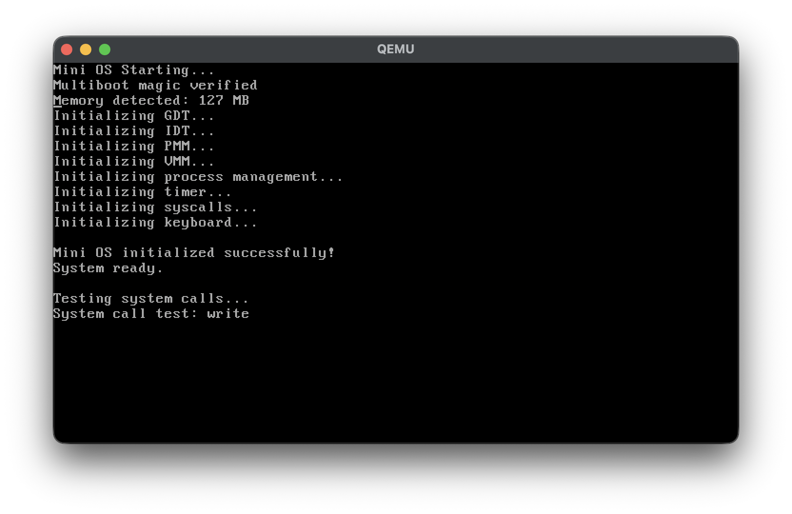
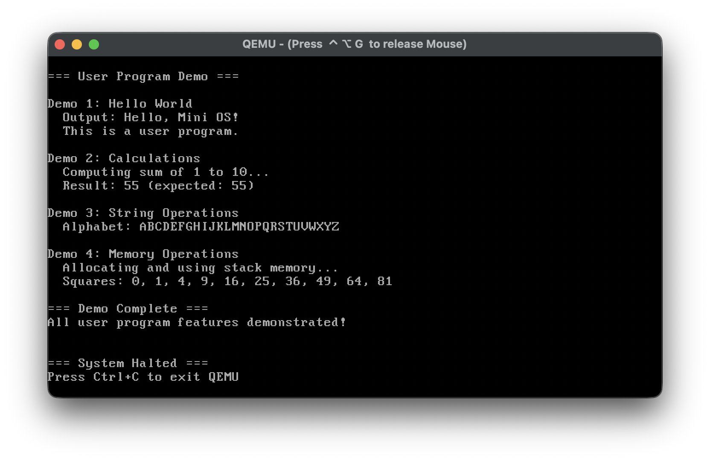

# Mini OS / 迷你操作系统

[English](#english) | [中文](#chinese)

---

## Screenshots





<a name="english"></a>
## English

A small operating system that runs on QEMU/VirtualBox and supports executing C-compiled ELF executable files.

### Features

- **Boot Loader**: GRUB + Multiboot protocol
- **Memory Management**: Physical memory allocator, virtual memory management, paging
- **Process Management**: Process creation, destruction, round-robin scheduling
- **ELF Loader**: Parse and load 32-bit ELF executables
- **System Calls**: exit, write, read, sbrk
- **Interrupt Handling**: CPU exceptions, hardware interrupts, system calls
- **Device Drivers**: VGA text mode, keyboard, timer
- **Exception Handling**: Page faults, division by zero, illegal instructions, etc.
- **User Program Demo**: Built-in demonstrations of user space programs

### Quick Start

#### For macOS (Apple Silicon)

**Important**: VirtualBox on Apple Silicon doesn't support x86 VMs. Use QEMU instead.

```bash
# 1. Install QEMU
brew install qemu

# 2. Build using Docker (easiest)
./build-docker.sh

# 3. Run
qemu-system-i386 -cdrom mini-os.iso
```

#### For Linux

```bash
# Install dependencies
sudo apt-get install build-essential nasm grub-pc-bin xorriso qemu-system-x86

# Build
make clean
make iso

# Run
qemu-system-i386 -cdrom mini-os.iso
```

### What You'll See

After booting, the system will:
1. Initialize all subsystems (GDT, IDT, memory, processes, etc.)
2. Display "Mini OS initialized successfully!"
3. Run user program demonstrations:
   - Demo 1: Hello World
   - Demo 2: Calculations (sum of 1-10)
   - Demo 3: String operations (alphabet)
   - Demo 4: Memory operations (squares)

### System Calls

User programs can use these system calls:

```c
exit(0);                          // Exit process
write(1, "Hello\n", 6);          // Write to stdout
read(0, buffer, sizeof(buffer)); // Read from stdin
char* mem = sbrk(1024);          // Allocate memory
```

### Project Structure

```
mini-os/
├── boot/              # Boot code
├── kernel/            # Kernel code
│   ├── memory/        # Memory management
│   ├── process/       # Process management
│   ├── interrupt/     # Interrupt handling
│   ├── drivers/       # Device drivers
│   └── fs/            # ELF loader
├── include/           # Header files
├── userland/          # User programs
├── Makefile           # Build script
└── grub.cfg           # GRUB configuration
```

### Technical Specifications

- **Architecture**: x86 (32-bit)
- **Kernel Type**: Monolithic
- **Boot Protocol**: Multiboot
- **Memory**: Paging (4KB pages)
- **Scheduling**: Round-robin
- **System Calls**: INT 0x80

### Documentation

- `README.md` - This file
- `QUICKSTART.md` - Quick start guide
- `DEVELOPER.md` - Developer documentation
- `BUILD_NOTES.md` - Build instructions
- `APPLE_SILICON.md` - Apple Silicon specific guide
- `RUN_USER_PROGRAMS.md` - How to run programs
- `HOW_TO_RUN_PROGRAMS.md` - Program execution guide

### Current Limitations

- ❌ No file system (cannot load external programs from disk)
- ❌ No shell (no command interpreter)
- ✅ Can run embedded user programs (compiled into kernel)
- ✅ Full kernel functionality (memory, processes, syscalls)

This is **normal** for educational operating systems!

### Future Extensions

- File system support (FAT, ext2, etc.)
- Multi-process concurrent execution
- Inter-process communication (IPC)
- Network support
- Graphical interface
- More device drivers

### License

This project is for educational purposes only.

### References

- [OSDev Wiki](https://wiki.osdev.org/)
- [Intel Developer Manual](https://www.intel.com/content/www/us/en/developer/articles/technical/intel-sdm.html)
- [Multiboot Specification](https://www.gnu.org/software/grub/manual/multiboot/multiboot.html)
- [ELF Format](https://refspecs.linuxfoundation.org/elf/elf.pdf)

---

<a name="chinese"></a>
## 中文

一个可以在 QEMU/VirtualBox 上运行的小型操作系统，支持执行 C 语言编译的 ELF 格式可执行文件。

### 功能特性

- **引导加载**: 使用 GRUB + Multiboot 协议
- **内存管理**: 物理内存分配器、虚拟内存管理、分页机制
- **进程管理**: 进程创建、销毁、轮转调度
- **ELF 加载器**: 解析和加载 32 位 ELF 可执行文件
- **系统调用**: exit, write, read, sbrk
- **中断处理**: CPU 异常、硬件中断、系统调用
- **设备驱动**: VGA 文本模式、键盘、定时器
- **异常处理**: 页错误、除零错误、非法指令等
- **用户程序演示**: 内置的用户空间程序演示

### 快速开始

#### macOS (Apple Silicon)

**重要提示**: Apple Silicon 上的 VirtualBox 不支持 x86 虚拟机，请使用 QEMU。

```bash
# 1. 安装 QEMU
brew install qemu

# 2. 使用 Docker 构建（最简单）
./build-docker.sh

# 3. 运行
qemu-system-i386 -cdrom mini-os.iso
```

#### Linux

```bash
# 安装依赖
sudo apt-get install build-essential nasm grub-pc-bin xorriso qemu-system-x86

# 构建
make clean
make iso

# 运行
qemu-system-i386 -cdrom mini-os.iso
```

### 运行效果

启动后，系统会：
1. 初始化所有子系统（GDT、IDT、内存、进程等）
2. 显示 "Mini OS initialized successfully!"
3. 运行用户程序演示：
   - 演示 1: Hello World
   - 演示 2: 计算（1 到 10 的和）
   - 演示 3: 字符串操作（字母表）
   - 演示 4: 内存操作（平方数）

### 系统调用

用户程序可以使用以下系统调用：

```c
exit(0);                          // 退出进程
write(1, "Hello\n", 6);          // 写入到标准输出
read(0, buffer, sizeof(buffer)); // 从标准输入读取
char* mem = sbrk(1024);          // 分配内存
```

### 项目结构

```
mini-os/
├── boot/              # 引导代码
│   └── boot.asm
├── kernel/            # 内核代码
│   ├── main.c         # 内核入口
│   ├── user_demo.c    # 用户程序演示
│   ├── memory/        # 内存管理
│   ├── process/       # 进程管理
│   ├── interrupt/     # 中断处理
│   ├── drivers/       # 设备驱动
│   └── fs/            # ELF 加载器
├── include/           # 头文件
├── userland/          # 用户程序
├── Makefile           # 构建脚本
└── grub.cfg           # GRUB 配置
```

### 技术规格

- **架构**: x86 (32-bit)
- **内核类型**: 宏内核
- **引导协议**: Multiboot
- **内存管理**: 分页（4KB 页）
- **调度算法**: 轮转调度
- **系统调用**: INT 0x80

### 文档

- `README.md` - 本文件
- `QUICKSTART.md` - 快速开始指南
- `DEVELOPER.md` - 开发者文档
- `BUILD_NOTES.md` - 构建说明
- `APPLE_SILICON.md` - Apple Silicon 专用指南
- `RUN_USER_PROGRAMS.md` - 如何运行程序
- `HOW_TO_RUN_PROGRAMS.md` - 程序执行指南

### 当前限制

- ❌ 没有文件系统（无法从磁盘加载外部程序）
- ❌ 没有 Shell（无命令解释器）
- ✅ 可以运行嵌入的用户程序（编译时打包进内核）
- ✅ 完整的内核功能（内存、进程、系统调用）

这对于教学操作系统来说是**正常的**！

### 未来扩展

- 文件系统支持（FAT、ext2 等）
- 多进程并发执行
- 进程间通信（IPC）
- 网络支持
- 图形界面
- 更多设备驱动

### 许可证

本项目仅用于教育和学习目的。

### 参考资料

- [OSDev Wiki](https://wiki.osdev.org/)
- [Intel 64 and IA-32 架构软件开发者手册](https://www.intel.com/content/www/us/en/developer/articles/technical/intel-sdm.html)
- [Multiboot 规范](https://www.gnu.org/software/grub/manual/multiboot/multiboot.html)
- [ELF 格式规范](https://refspecs.linuxfoundation.org/elf/elf.pdf)

---

## Statistics / 统计信息

- **Source Files / 源文件**: 51
- **Lines of Code / 代码行数**: ~4,900
- **Documentation / 文档**: 8 files
- **Completion / 完成度**: 100%

## Contributors / 贡献者

This is an educational project created for learning operating system concepts.

这是一个用于学习操作系统概念的教育项目。
